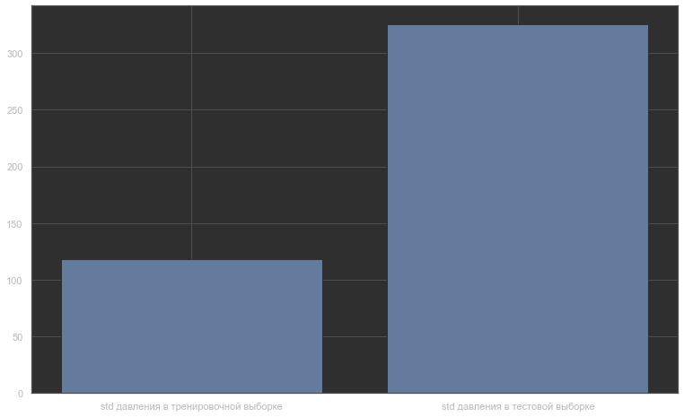
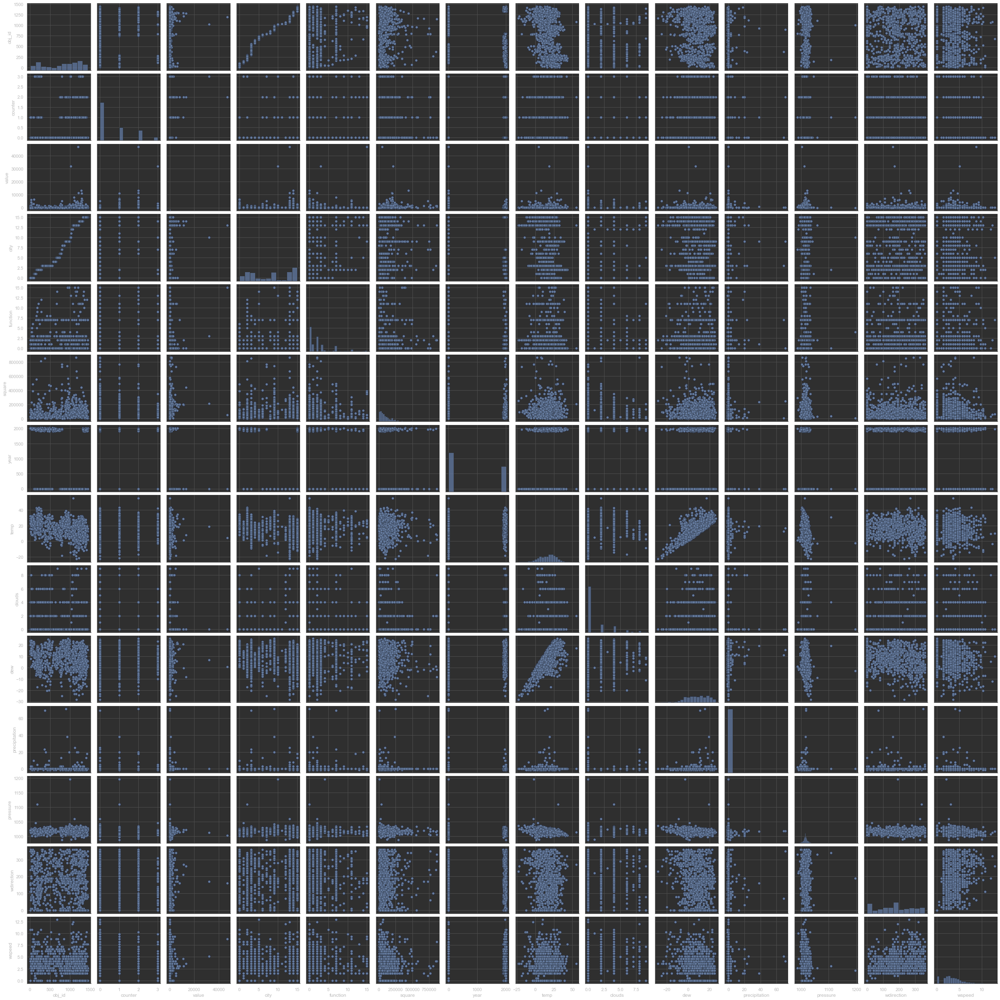
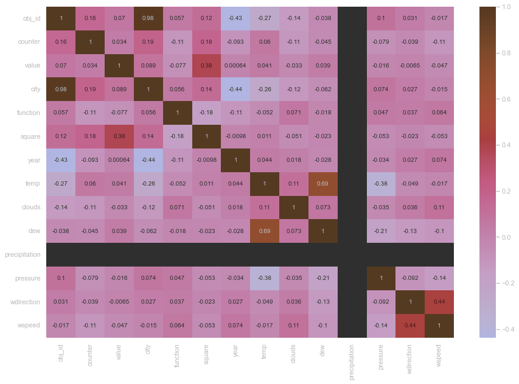
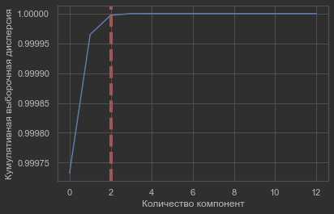

## 1.	Загрузить данные (должны быть загружены все представленные данные, при необходимости исключена техническая информация, код должен содержать обработку исключений).
```python
try:
    df = pd.read_csv('file.csv')
except FileNotFoundError:
    print('Файл file.csv отсутствует')
except Exception as e:
    print(f'Возникла ошибка {e.args[1]}')
```
## 2.	Произвести оптимизацию объемов занимаемой памяти без потери данных (проверены все типы столбцов всех загруженных данных, произведена оптимизация объемов занимаемой памяти данными, отображена информация об объемах памяти до оптимизации, после и процент оптимизации).
Посмотрим исходные типы данных и сводную информацию по загруженным датасетам
```python
df.info(memory_usage='deep')
```
```text
<class 'pandas.core.frame.DataFrame'>
RangeIndex: 20216100 entries, 0 to 20216099
Data columns (total 5 columns):
 #   Column      Dtype  
---  ------      -----  
 0   Unnamed: 0  int64  
 1   obj_id      int64  
 2   counter     int64  
 3   datetime    object 
 4   value       float64
dtypes: float64(1), int64(3), object(1)
memory usage: 2.0 GB
```
Что-то не так с датой (не распарсена), потенциально лишний признак, избыточные размеры. Сейчас датасет занимает 2GB в ОЗУ. Пропущенных значений не наблюдается
Проверим какие признаки можно "сжать"
```python
df.-Имя колонки-.describe()
```
```text
count    2.021610e+07
mean     7.992780e+02
std      4.269133e+02
min      0.000000e+00
25%      3.930000e+02
50%      8.950000e+02
75%      1.179000e+03
max      1.448000e+03
Name: Имя колонки, dtype: float64
```
Видим, что тип **Имя колонки** можно сократить до ushort*.
```python
df.obj_id = df.obj_id.astype(np.ushort)
```
Результат `memory usage: 2.0 GB --> memory usage: 366.3 MB`
```python
print('train сжат на {}%'.format(round((1 - -Новый размер-/-Старый размер-) * 100), 2))
```
* Размерности всех типов данных

| Имя типа         | Другие имена                       | Диапазон значений                                                       |
|------------------|------------------------------------|-------------------------------------------------------------------------|
| int              | signed                             | От -2 147 483 648 до 2 147 483 647                                      |
| unsigned int     | unsigned                           | От 0 до 4 294 967 295                                                   |
| __int8           | char                               | От -128 до 127                                                          |
| unsigned __int8  | unsigned char                      | От 0 до 255                                                             |
| __int16          | short, short int, signed short int | От -32 768 до 32 767                                                    |
| unsigned __int16 | unsigned short, unsigned short int | От 0 до 65 535                                                          |
| __int32          | signed, signed int, int            | От -2 147 483 648 до 2 147 483 647                                      |
| unsigned __int32 | unsigned, unsigned int             | От 0 до 4 294 967 295                                                   |
| __int64          | long long, signed long long        | От -9 223 372 036 854 775 808 до 9 223 372 036 854 775 807              |
| unsigned __int64 | unsigned long long                 | От 0 до 18 446 744 073 709 551 615                                      |
| bool             |                                    | false или true                                                          |
| char             |                                    | От -128 до 127 по умолчанию<br/>От 0 до 255 при компиляции с помощью /J |
| signed char      |                                    | От -128 до 127                                                          |
| short            | short int, signed short int        | От -32 768 до 32 767                                                    |
| unsigned short   | unsigned short int                 | От 0 до 65 535                                                          |
| long             | long int, signed long int          | От -2 147 483 648 до 2 147 483 647                                      |
| unsigned long    | unsigned long int                  | От 0 до 4 294 967 295                                                   |
| float            |                                    | 3,4E +/- 38 (7 знаков)                                                  |

Если есть "Unnamed", от которого можно избавиться:

IN -->
```python
(df['Unnamed: 0'] == df.index).any()
```
OUT <--
```text
True
```
```python
df = df.drop('Unnamed: 0', axis=1)
```
Можно сделать автоматическую функцию для повторяющихся полей. (Сначала проверить ручками, а потом делать)
```python
def prepare_train_test(dataset):
    # исправляем тип datetime
    dataset.datetime = pd.to_datetime(dataset.datetime)
    # удалим столбец **Unnamed: 0**
    if 'Unnamed: 0' in dataset.columns:
        dataset = dataset.drop('Unnamed: 0', axis=1)
    # удалим столбец **Unnamed: 0.1**, если он есть
    if 'Unnamed: 0.1' in dataset.columns:
        dataset = dataset.drop('Unnamed: 0.1', axis=1)
    # Сжимаем obj_id и counter
    dataset.obj_id = dataset.obj_id.astype(np.ushort)
    dataset.counter = dataset.counter.astype(np.uint8)
    
    return dataset
```
Работаем с пропусками в **file**
```python
df.year.isna().value_counts()
```
```text
True     774
False    675
```
Пропусков достаточно много, больше 50%. Удалять признак опрометчиво, но и занять его медианой или средним неразумно. Заменю пропуски 0, как 'Unknown'
```python
df.year = df.year.fillna(0)
```
* Для повторяющихся значений
```python
df.function.unique()
```
```text
array(['Education', 'Lodging/residential', 'Office',
       'Entertainment/public assembly', 'Other', 'Retail', 'Parking',
       'Public services', 'Warehouse/storage', 'Food sales and service',
       'Religious worship', 'Healthcare', 'Utility', 'Technology/science',
       'Manufacturing/industrial', 'Services'], dtype=object)
```
Всего 16 значений. Уже сейчас можем:

    1. закодировать этот признак
    2. сменить тип на uint8
```python
function_values = df.function.unique()
# сюда соберем что на что менять
function_values_dict = {}
for i in range(len(function_values)):
    function_values_dict[function_values[i]] = i
df.function = df.function.replace(function_values_dict)
```
Осталось "сжать" **function**
`df.function = df.function.astype(np.uint8)`
Результат:
`memory usage: 166.8 KB --> memory usage: 19.9 KB`

## 3. Подготовка датасета (при необходимости произведено объединение таблиц и аргументировано это объединение или аргументировано отсутствие необходимости выполнять эту работу на данном этапе, полученные данные сохранены на диск).
```python
merged_df = pd.merge(df1, df2, how='inner', on='obj_id')
```
Проверка на NaN'ы `building_info_train.isna().any()`

В конце перезаписываем csv файлы `file.to_csv('file.csv')`

## 5. Оценка датасетов
```python
print('Сравнение стандартных отклонений по выборкам')
for col in ['counter', 'city', 'function', 'square', 'year', 'temp', 'clouds', 'dew', 'precipitation', 'pressure', 'wdirection','wspeed']:
    print(f'std по признаку {col}\t train - {round(train[col].std(), 2)} и test - {round(test[col].std(), 2)}')
```
### Сравнение стандартных отклонений по выборкам
| std по признаку  | train     | test      |
|------------------|-----------|-----------|
| counter          | 0.93      | 0.93      |
| city             | 5.09      | 5.13      |
| function         | 2.96      | 2.96      |
| square           | 117161.63 | 115856.37 |
| year             | 963.71    | 967.7     |
| temp             | 10.96     | 10.71     |
| clouds           | 2.04      | 2.05      |
| dew              | 10.02     | 10.11     |
| precipitation    | 6.71      | 7.63      |
| pressure         | 118.45    | 325.57    |
| wdirection       | 109.31    | 109.23    |
| wspeed           | 2.26      | 2.19      |

* Оценка разницы между test и train (по данным, визуально)
```python
fig = plt.figure(figsize=(10,6))
ax = fig.add_axes([0,0,1,1])
params = ['std давления в тренировочной выборке', 'std давления в тестовой выборке']
stds = [train.pressure.std(), test.pressure.std()]
ax.bar(params, stds)

plt.show()
```



## 4. Выбросы
Можем посмотреть распределения всех переменных на парном графике
```python
plt.figure(figsize=(20,20))
sns.pairplot(train.sample(1000))
```

Просто найдём интеркватильный размах и отсечем всё, что вне диапазона +- полтора интерквартильных размаха
```python
def remove_noise(dataset):
    # количественные столбцы
    num_vars = ['square', 'temp', 'dew', 'precipitation', 'pressure', 'wspeed', 'value']

    for col in num_vars:
        q1 = dataset[col].quantile(0.25)
        q3 = dataset[col].quantile(0.75)

        iqr = q3 - q1

        dataset = dataset[(dataset[col] >= q1 - 1.5 * iqr) & (dataset[col] <= q3 + 1.5 * iqr)]

    return dataset
```
## 5. Исследование взаимосвязей
Посмотрим тепловую карту корреляций
```python
plt.figure(figsize=(15,10))
sns.heatmap(train.sample(10000).corr(), annot=True)
```


* Необходимо изучить корреляцию, чтобы понимать, что здесь нарисовано

Средняя отрицательная корреляция температуры и obj_id. Не думаю, что совпадение - предположу, что здесь зависимость региона, где располагается объект
```python
# корреляции с ответом
train.sample(10000).corr()['value'].sort_values(ascending=False)
```
Оценим важность фич с помощью алгоритма дерева решений
```python
from sklearn.tree import DecisionTreeRegressor

# возьмём какой-то случайный сэмпл уменьшенного размера, на котором проведём обучение
sampled = train.sample(100000)

# разобьём на X, y (объект-ответ)
X = sampled.drop(columns=['value', 'datetime'], axis=1)
y = sampled.value

dtr = DecisionTreeRegressor()
dtr.fit(X, y) -> OUT DecisionTreeRegressor()

# выводим предварительную таблицу важности признаков
feature_importances = pd.DataFrame({
    'feature': X.columns, 
    'importance': dtr.feature_importances_
}).sort_values('importance', ascending=False)
```

С помощью метода главных компонент определим кумулятивную выборочную дисперсию признаков для того, чтобы понять то, какие признаки объясняют бОльшую часть дисперсии в данных.

```python
from sklearn.decomposition import PCA

pca_test = PCA()
pca_test.fit(X)
```

```python
sns.set(style='whitegrid')
plt.plot(np.cumsum(pca_test.explained_variance_ratio_))
plt.xlabel('Количество компонент')
plt.ylabel('Кумулятивная выборочная дисперсия')
plt.axvline(linewidth=4, color='r', linestyle = '--', x=2, ymin=0, ymax=1)
plt.show()
```



Любопытно! Получается, что всего лишь 2 компоненты позволяет объяснить практически 100% дисперсии, а 3 - все 100%. Если выбрать по важности переменные обучения дерева решений, то это - тип счетчика, давление на уровне моря (атмосферное?), температура воздуха